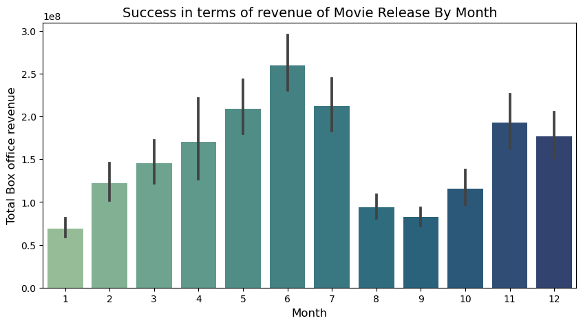
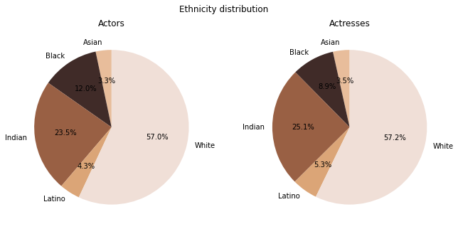

# What makes a movie successful?
## Table of contents
- [Abstract](#abstract)
- [Research Questions](#research-questions)
- [Proposed additional datasets and files](#proposed-additional-datasets-and-files)
- [Methods](#methods)
- [Proposed timeline](#proposed-timeline)
- [Organisation within the team](#organisation-within-the-team)
- [Questions for the TAs](#questions-for-the-tas)

## Abstract

What makes a movie successful? While this question may seem like a low-hanging fruit, it requires a very holistic approach. A good film should not only make use of the 7th Art but of all seven Arts. A movie implies many choices: what genres to focus on, which director and actors bring the most added value, what budget to spend? With such a big movie database, we can expect to find some patterns for which those choices lead to more successful movies. But then again, what makes a movie successful? From profitability to perenniality, we shall investigate different success indicators. The ideal goal for our data story would be to draw a generator for the next successful movie: a user can select a genre of interest and we suggest the ideal combo of actors, director, budget, diversity, etc. Additionally, a linear regression is trained such as to forecast, based on those chosen features, the success of the movie (Score, Gross revenue, pageviews, rating).

## Research Questions

Using our current and future analysis, we aim to answer the following questions:

- What budget should be invested for a successful film? 
- Which actors and directors bring the most added value to a movie?
- What combinations of genre is most successful?
- What release months are most profitable? 
- What is the diversity (race & genre) in movie production? Is this evolving with time?
- What main themes come out of plots?
- Are happy endings/beginnings better or worse that sad endings/beginnings?

## Proposed additional datasets and files

- [IMDB official dataset](https://www.imdb.com/interfaces/): The goal of this dataset is to obtain information on IMDB ratings, directors, and missing information of different movies.
- [IMDB budget](https://github.com/jeremy-lee93/dsc-mod-1-project-v2-1-onl01-dtsc-pt-052620/blob/master/IMDb_budgets.csv): The added value of this dataset is mainly the budget spent and other features which we already have to complete NaN.
- Wikipedia pageview statistics for movies: dataset crowed from Wikipedia pageview statistics public API. `utils/extract_wikipedia_pageview_statistics.py` is the script for obtaining this dataset. Its input is a dataframe with movie names and its output is a dataframe with pageview statistics.
- ADD NIKOLAY DATASET

## Methods

### Step 1: Data loading
* `movies`: dataframe including information from CMU movies
* `characters`: dataframe including information from CMU movie characters
* `imdb`: dataframe including information for all movies present in IMDB
* `imdb_budget`: dataframe including information from 3828 IMDB movies
* `wikipedia_pageviews`: dataframe including information on movies’ weighted average pageviews for the last year

### Step 2: Cleaning & Pre-processing of data

For all datasets: Convert number to correct data types (int, float). Check outliers either by web proofing (ex: check on the internet what is the minimum length of ever-made movies) or by common sense (ex: actor height cannot be above 4m). The other outliers are filtered. Replace corrupted elements when finding data on the internet. Remove encoding if there are any in the datasets. 

#### Step 2.1: Movies

Creation of a weighted IMDB rating to account for rating and number of votes. We also account for inflation rates to modify all revenue, profit, and budget with the US inflation rate since 1913.  Proceed with left merge based on datasets movies, imdb, imdb_budget, wikipedia_pageviews. The goal of this left merge to the original dataset is to combine common features while conserving the original dataset length to still be able to investigate the data fully. The redundant columns between datasets are used to fill in missing values to have a more complete dataset.

#### Step 2.2: Characters
The character dataset preprocessing work was aimed at finding the ethnicities of the characters/authors. The original dataset only provided freebase ids which had to be translated into “readable” ethnicity. To solve this problem, a script has been created to obtain the identifier-label equivalences from Wikidata. In addition, manual work has also been done classifying the main races. Five main groups are extracted to ease comparison: Black, Asian, Indian, Latin, and White people. All the implementation information can be found in the main file.

### Step 3: Exploratory analysis

#### Step 3.1: Movies
A movie involves very diverse features. A correlation heat map is created to investigate links between features. The focus is put on distribution and link to profitability and success on the following features: release month, genres, profit VS budget for top movies, actors, and directors. With multiple features, a single success score based on the four following success features: Wikipedia pageviews, IMDB weighted ratings, gross revenue, profit. 
From there, we proceed with the creation of a weighted score for features such as actors, directors, genres, based on the movie score and the number of movies in which individuals of features appear. The same thing is done for actor, director, genre collaborations. We also look into which is the best period to release a movie by comparing accoss months the gross revenue.

  

#### Step 3.2: Characters
A movie is nothing without its actors. To analyze the success of a film, it is essential to look at its characters and by whom they are portrayed. The main objective of this point is to discover what are the characteristics that make an actor successful and, therefore, the film in which he participates. The character dataset allows us to study the main physical characteristics of the actors: gender, height, ethnicity, and age in which they participated in the movie. For instance, the following graph shows the distribution of ethnicities among actors and demonstrates the existence of a racial trend in the film industry. We further look into the evolution of these trends according to genres.

 

MEHDI UPDATE BELOW
#### Step 3.3: Cross movies and characters results
For the next milestone and to determine the overall success of the films, the analyses made for the films and the characters or actors that have been made independently for this installment will be cross-referenced.

#### Step 3.4: Clustering movies according to plot type
Using the processed summaries with NLP we would analyze movie plots and try to separate them into clusters (happy ending vs sad ending…) (inspiration: “The Seven Basic Plots: Why We Tell Stories” - Christopher Booker).

#### Step 3.5: Countries

To assert how representative our dataset is of movies made in different parts of the world, we decided to plot the distribution of movies by country. As expected, we note that almost half the dataset is made up of American movies.
We also want to know if this distribution has maybe changed over time, so we separate the dataset approximately in two: movies made before 1985 and movies made after 1985 and we run the previous analysis on the two subsets. We can see that the United States dominates movie production (or at least the dataset) but that Indian cinema has become more and more important.

### Step 4: Try to advise choices of features for a successful movie

We cluster all the above investigations across genres to advise the creation of successful movies. The representation of best actors, directors and genres is done through network graphs which size of node is proportional to the success of the individual and which edge, if exists, symbolises the added value of a collaboration between two individuals. 

### ADD COMMENT ON WORD PLOT (MEHDI)

A neural network is trained to be able to forecast the success (pageviews, revenue, profit, rating) of a movie. Due to low accuracy, we ended up turning to a linear regression model to allow this forecast. 
### COMPLETE BY nichoLAY

## Organisation within the team

| Teammate| Task |
| --- | --- |
| Pau | Creation of the ethnicity and genre evolution plots. Creation of the website structure. |
| Mehdi | Investigate word bank and sentiment analysis in plot lines across genres |
| Nikolay| Creation of a neural network and regression analysis models. Best release months graphs. |
| Olivia| Creation of movie, actors, director, genre scores. Creation of bubble graph for reprensentation. Interactive plots on webpage. Creation of text for website. |                                                                                      
                                                                                        

                                                                                       

